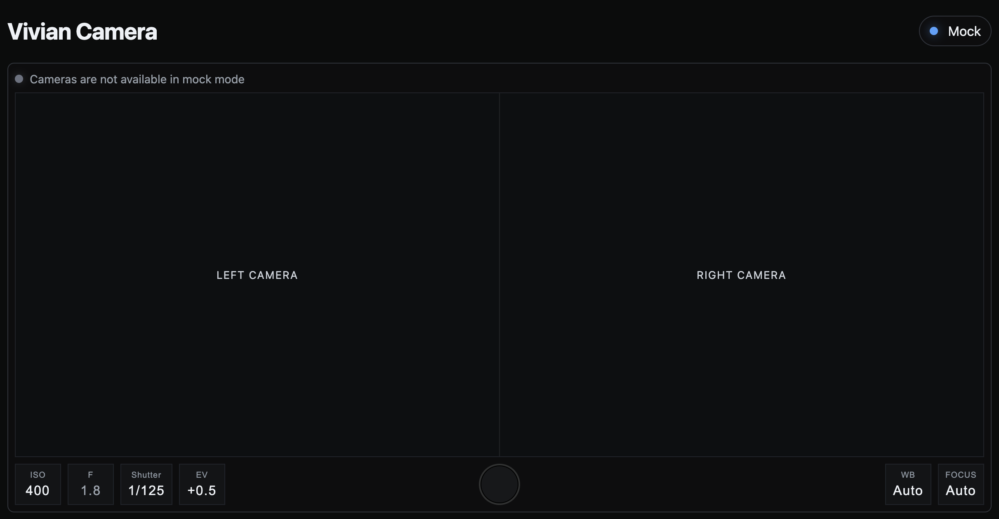

# Vivian Camera

Current status: **Early Experimental Stage**




---

## Development Roadmap

### Phase 1 — Camera Prototype

Goal: establish a basic camera capture pipeline using Raspberry Pi 5

- Implement synchronized image capture
- Basic CLI workflow for capture


### Phase 2 — Data Pipeline & Organization

Goal: Build a reliable pipeline for storing and managing stereo image data

---

## Run

### Local Development

```
cd software
python3 -m pip install -r requirements.txt

cd web
PORT=5050 USE_MOCK_PREVIEW=1 python3 preview_server.py
```

### Raspberry Pi Usage (Real Camera Mode)

```
cd ~/vivian-camera
git pull

cd software
cd web
USE_MOCK_PREVIEW=0 python3 preview_server.py
```

---

## Project Naming

**Vivian** comes from **Vi + Vi (Vision + Vision)** — representing the two perspectives captured by a stereo camera.

This project is partially inspired by the spirit of Vivian Maier’s photography.